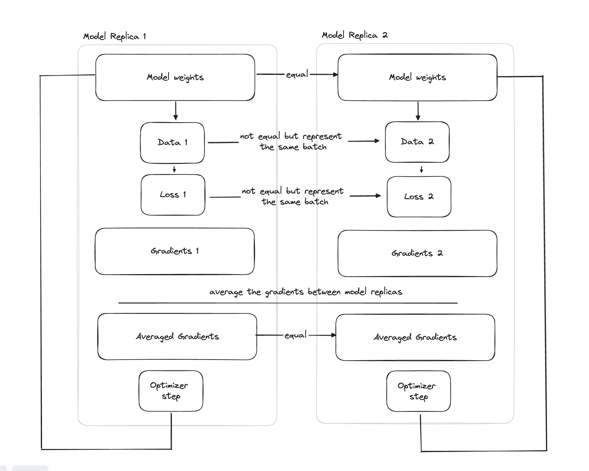

# Data-Parallel: Implementing Data Parallelism from Scratch
## Links

## Description
👋 Ever wondered how data parallelism worked in practice? The goal of this project is to de-mystify concretely a lot of the magic that happens under the hood.

It generally works something like this...

## Project breakdown
### Baseline
`src/torch_dp.py` uses torch `DataParallel` to set up a very simple baseline to compare our implementations against. Similarly, `src/model_base.py` creates a set of toy model utilities to exercise them on.

### Simple Custom Implementation
`src/simple_dp.py` contains a sequential implementation of data parallelism — it does not leverage any of the benefits of being data parallel, but does implement the entire process end to end manually. New readers into this process might find this file useful. `src/compare_torch_v_simple.py` can be used to run a values comparison (and find them ~1e-6 off of the torch implementation).

### Next up
- Replacing gradient accumulation and averaging with a simple ring all reduce implementation
- Parallelizing the model calls for forward passes, backward passes, and optimizer step
- Enabling cross node training without torch.distributed and MPU communication patterns.

## Contributions?
Much as I'd like to maintain this project, it is more effective as a tool for learning than as a model training platform. Consider using many of the alternatives, like HuggingFace, torch or Modal instead!
